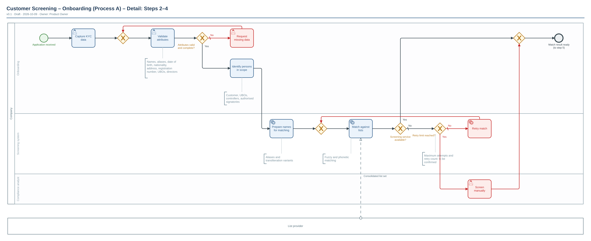

# Customer Screening – Onboarding (Process A) – Detail: Steps 2–4

| | |
|---|---|
| **Diagram type** | BPMN 2.0 process |
| **Version** | 0.1 |
| **Status** | Draft |
| **Owner** | Product Owner |
| **Date** | 2026-10-09 |
| **Audience** | Analysts and engineers (detail) |
| **Based on** | User description "Process A: Customer screening (onboarding)" and answers to clarification questions |

Source: [`customer-screening-detail-steps-2-4.bpmn`](./customer-screening-detail-steps-2-4.bpmn) · Vector: [`customer-screening-detail-steps-2-4.svg`](./customer-screening-detail-steps-2-4.svg)

## At a glance

- Expands steps 2–4 of the overview: collecting and validating data, determining scope, and running the automated match.
- Involves Onboarding, the Screening system and a Compliance analyst, plus the external List provider.
- Ends when a match result is ready, which feeds step 5 ("Potential match?") in the [overview](../customer-screening-overview/README.md).
- Two failure paths: missing or invalid attributes (loop back to re-validate), and screening service unavailable (retry, then manual screening).
- Maximum attempts and retry count are not specified.

## Walkthrough

1. Process starts when an application is received.
2. Onboarding captures the KYC data and validates the attributes (names, aliases, date of birth, nationality, address, registration number, UBOs, directors).
3. Decision "Attributes valid and complete?"
   - No (exception path): Onboarding requests the missing data and the attributes are validated again. The maximum number of attempts is not defined (Q3).
   - Yes: continue.
4. Onboarding identifies the persons in scope: customer, UBOs, controllers, authorised signatories.
5. The Screening system prepares the names for matching (aliases and transliteration variants).
6. The Screening system matches them against the consolidated list set from the List provider (fuzzy and phonetic matching).
7. Decision "Screening service available?"
   - Yes: the match result is ready.
   - No (exception path): decision "Retry limit reached?". If not, the match is retried. If reached, the Compliance analyst screens manually and the result is then ready.
8. The process ends with "Match result ready (to step 5)".

## Legend & glossary

| Symbol / term | Meaning |
|---|---|
| Pool / lane | Pool "Company" with lanes Onboarding, Screening system and Compliance analyst. "List provider" and "Alert Handling" are external parties shown as empty boxes (their internals are not drawn). |
| Dashed arrow | Message sent between different parties. |
| Diamond with X | Decision: exactly one outgoing path is taken. A diamond without text only merges paths. |
| Green circle / thick circle | Start / end of the process. |
| Dotted line to bracket | Note attached to a step. |
| UBO | Ultimate beneficial owner. |
| KYC | Know your customer: the identity data collected about a customer. |
| Gateway without text | Merge: several paths rejoin or loop back. |

Red elements show exception paths.

## Assumptions

| # | Assumption | Why assumed |
|---|---|---|
| A1 | Lane assignments: Onboarding captures, validates and identifies persons; the Screening system prepares names, matches and retries; the Compliance analyst screens manually. The final merge and end event sit in the Onboarding lane because the result returns to onboarding's flow. | Lane owners were not stated. |
| A2 | "Capture KYC data" is the first task after the single start event "Application received". | Confirmed during clarification. |
| A3 | Request missing data is done by an Onboarding person and has no customer pool. | No customer participant was requested. |
| A4 | After the retry limit, the Compliance analyst screens manually. | Stated as the fallback. |
| A5 | "Prepare names for matching" and "Identify persons in scope" are split out as separate steps. | Needed for the detail level; they only restate steps 3 and 4. |
| A6 | No SLAs or timers are shown. | None were specified. |

## Open questions

| # | Question | Suggested owner |
|---|---|---|
| Q1 | Which sanctions regimes and lists apply, and does each aggregate ownership stakes? To be confirmed; the aggregation rule differs between regimes and was only checked through secondary summaries, so it could not be verified here. | Compliance lead |
| Q2 | What is the ownership threshold value, and is it the same for every regime and list? | Compliance lead |
| Q3 | What are the loop and retry limits (maximum attempts to request missing data, number of match retries before manual screening)? | Product Owner with Screening system owner |
| Q4 | Who is notified when the ownership threshold is met ("Escalated")? | Compliance lead |
| Q5 | Does Alert Handling return a result (onboard / reject / escalate / pending resolved) to onboarding? If yes, a return message flow and a continuation are needed. | Product Owner with Alert Handling owner |
| Q6 | After manual screening, is the result handled in the same way as an automated result? | Compliance lead |

## How to edit

- `.bpmn`: open in [bpmn.io demo](https://demo.bpmn.io) or Camunda Modeler. Layout is generated; re-run the renderer after semantic changes.

## Change log

| Version | Date | Change | By |
|---|---|---|---|
| 0.1 | 2026-10-09 | Initial draft | Product Owner |
