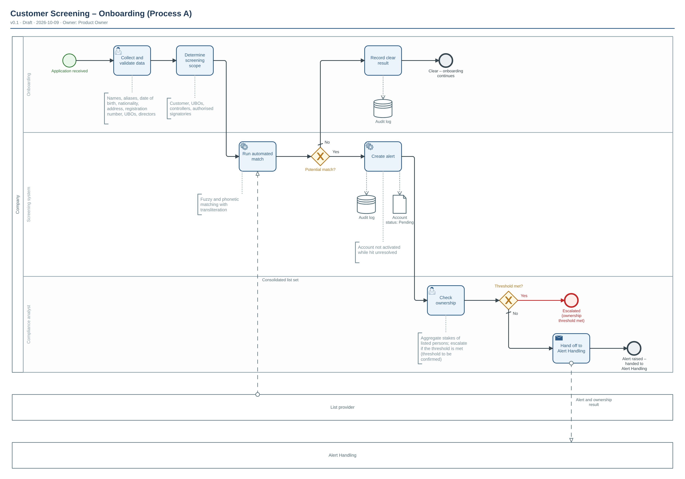

# Customer Screening – Onboarding (Process A)

| | |
|---|---|
| **Diagram type** | BPMN 2.0 process |
| **Version** | 0.1 |
| **Status** | Draft |
| **Owner** | Product Owner |
| **Date** | 2026-10-09 |
| **Audience** | Executives, product and compliance stakeholders (overview) |
| **Based on** | User description "Process A: Customer screening (onboarding)" and answers to clarification questions |

Source: [`customer-screening-overview.bpmn`](./customer-screening-overview.bpmn) · Vector: [`customer-screening-overview.svg`](./customer-screening-overview.svg)

## At a glance

- Shows how a new customer, and the people behind it, is screened against the consolidated list set during onboarding.
- Involves Onboarding, the Screening system and a Compliance analyst, plus two external parties: List provider and Alert Handling.
- Three outcomes: clear (onboarding continues), alert raised and handed to Alert Handling, or escalated because the ownership threshold is met.
- The account is not activated while a hit is unresolved (status Pending). The decision to onboard, reject or escalate belongs to Alert Handling and is not drawn here.
- Failure paths (missing data, screening service unavailable) are in the detail diagram: [customer-screening-detail-steps-2-4](../customer-screening-detail-steps-2-4/README.md).

## Walkthrough

1. Process starts when an application is received.
2. Onboarding collects and validates the screening attributes (details in the detail diagram).
3. Onboarding determines the screening scope: customer, UBOs, controllers, authorised signatories.
4. The Screening system runs the automated match (fuzzy and phonetic matching with transliteration) against the consolidated list set supplied by the List provider.
5. Decision "Potential match?"
   - No: Onboarding records a clear result in the audit log and the process ends with "Clear – onboarding continues".
   - Yes: the Screening system creates an alert, writes it to the audit log and sets the account status to Pending.
6. The Compliance analyst checks ownership by aggregating the stakes of listed persons.
7. Decision "Threshold met?"
   - Yes (exception path, red): the process ends with "Escalated (ownership threshold met)".
   - No: the analyst hands the alert and ownership result to Alert Handling and the process ends with "Alert raised – handed to Alert Handling".

## Legend & glossary

| Symbol / term | Meaning |
|---|---|
| Pool / lane | Pool "Company" with lanes Onboarding, Screening system and Compliance analyst. "List provider" and "Alert Handling" are external parties shown as empty boxes (their internals are not drawn). |
| Dashed arrow | Message sent between different parties. |
| Diamond with X | Decision: exactly one outgoing path is taken. A diamond without text only merges paths. |
| Green circle / thick circle | Start / end of the process. |
| Dotted line to bracket | Note attached to a step. |
| UBO | Ultimate beneficial owner. |
| KYC | Know your customer: the identity data collected about a customer. |
| Account status: Pending | Data object: the account status set when an alert is created. |
| Audit log | Data store holding the clear result or alert record for traceability. |
| Aggregate stakes of listed persons | Adding up the ownership shares held by persons that appear on a list. The threshold value and the applicable regimes are not specified (see Q1, Q2). |

Red elements show exception paths.

## Assumptions

| # | Assumption | Why assumed |
|---|---|---|
| A1 | Lane assignments: Onboarding collects data, determines scope and records the clear result; the Screening system runs the match and creates the alert; the Compliance analyst checks ownership and hands off. | Lane owners were not stated. |
| A2 | The ownership check runs only after a potential match, because it aggregates stakes of listed persons. Ownership structure (UBOs, controllers) is collected before the match. | Confirmed during clarification. |
| A3 | Alert Handling is a black box and owns the onboard / reject / escalate decision (step 7). | Confirmed scope; its internals are out of scope. |
| A4 | The List provider supplies the consolidated list set to the match through a message flow. | Stated that the provider feeds the match; message content name is assumed. |
| A5 | No SLAs or timers, and no customer pool, are shown. | None were specified. |
| A6 | Attribute lists, scope, the matching approach and the ownership rule are shown as notes; full detail is in the detail diagram. | Overview level. |
| A7 | The Pending status is shown as a data object and a note, with no dedicated task. | Requested representation. |

## Open questions

| # | Question | Suggested owner |
|---|---|---|
| Q1 | Which sanctions regimes and lists apply, and does each aggregate ownership stakes? To be confirmed; the aggregation rule differs between regimes and was only checked through secondary summaries, so it could not be verified here. | Compliance lead |
| Q2 | What is the ownership threshold value, and is it the same for every regime and list? | Compliance lead |
| Q3 | What are the loop and retry limits (maximum attempts to request missing data, number of match retries before manual screening)? | Product Owner with Screening system owner |
| Q4 | Who is notified when the ownership threshold is met ("Escalated")? | Compliance lead |
| Q5 | Does Alert Handling return a result (onboard / reject / escalate / pending resolved) to onboarding? If yes, a return message flow and a continuation are needed. | Product Owner with Alert Handling owner |
| Q6 | Is the list match supplied by the List provider as a periodic list download or a live call? The diagram shows a single message. | Screening system owner |

## How to edit

- `.bpmn`: open in [bpmn.io demo](https://demo.bpmn.io) or Camunda Modeler. Layout is generated; re-run the renderer after semantic changes.

## Change log

| Version | Date | Change | By |
|---|---|---|---|
| 0.1 | 2026-10-09 | Initial draft | Product Owner |
