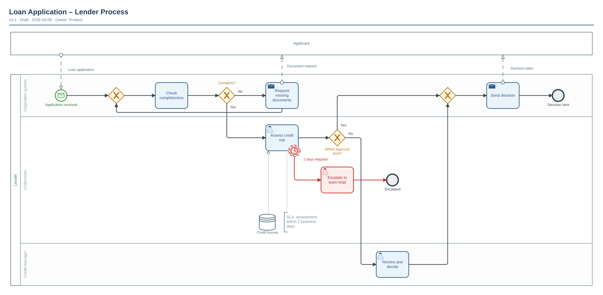

# Loan Application – Lender Process

| | |
|---|---|
| **Diagram type** | BPMN 2.0 process (collaboration: Applicant ↔ Lender) |
| **Version** | 0.1 |
| **Status** | Draft — *illustrative example, not a real process* |
| **Owner** | Product |
| **Date** | 2026-10-09 |
| **Audience** | Product, operations, engineering |
| **Based on** | Sample description used to demonstrate the diagram-architect toolchain |

Source: [`loan-application.bpmn`](./loan-application.bpmn) · Vector: [`loan-application.svg`](./loan-application.svg)

## At a glance

- Shows how a lender handles a loan application from receipt to a decision letter.
- Three internal roles: the origination system, the underwriter and the credit manager.
- Two outcomes: a decision is sent to the applicant, or the case is escalated when assessment takes too long.
- Key risk: assessment has a 2-business-day SLA; breaching it triggers escalation.

## Walkthrough

1. The applicant's loan application starts the process (message start event).
2. The system checks completeness. If incomplete, it requests the missing documents from the applicant and checks again (loop).
3. A complete application goes to the underwriter, who assesses credit risk using the credit bureau report.
4. If the assessment is not finished after 2 days, a timer event triggers escalation to the team lead (non-interrupting — assessment continues). *Exception path, shown in red.*
5. If the amount is within the approval limit, the decision is sent; otherwise the credit manager reviews and decides first.
6. The system sends the decision letter to the applicant and the process ends.

## Legend & glossary

| Symbol / term | Meaning |
|---|---|
| Pool (large box) | A party in the process, e.g. Applicant or Lender |
| Lane | A role or system inside the Lender pool |
| Green circle with envelope | Process starts when a message arrives |
| Diamond with X | Decision: exactly one outgoing path is taken |
| Dashed arrow between pools | Message sent from one party to another |
| Clock on a task border | Timer: fires after the stated time |
| Dotted open-ended line | Association to a data source or note |
| Red elements | Exception paths |
| SLA | Service-level agreement: agreed maximum handling time |

## Assumptions

| # | Assumption | Why assumed |
|---|---|---|
| A1 | The escalation timer is non-interrupting | Sample content; the example demonstrates the notation |
| A2 | Escalation ends the escalation branch, not the assessment | Same |

## Open questions

| # | Question | Suggested owner |
|---|---|---|
| Q1 | What is the approval limit and who sets it? | Credit policy owner |

## How to edit

- `.bpmn`: open in [bpmn.io demo](https://demo.bpmn.io) or Camunda Modeler. Layout is generated; re-run the renderer after semantic changes.

## Change log

| Version | Date | Change | By |
|---|---|---|---|
| 0.1 | 2026-10-09 | Initial example | Product |
